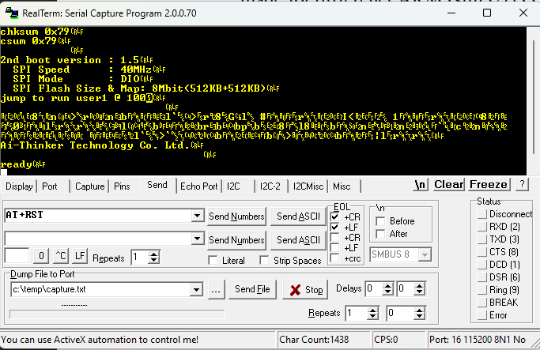

# IoT Application with STM32 Nucleo-L152RE and ESP-05 WiFi Module

This project implements an Internet-of-Things (IoT) temperature and humidity monitoring system using the **NUCLEO-L152RE development board**, **DHT22 sensor**, and **ESP-05 WiFi module**.  
Sensor data is measured on the STM32, transmitted over UART to the ESP-05, and forwarded to the cloud service **ThingSpeak** for online visualization.
ThingSpeak link: https://thingspeak.mathworks.com/channels/3146970 
---

## Project Photos

### IoT Dashboard Output

### Hardware Prototype

### Wi-Fi AT Command Configuration

---

## Objectives

- Learn to configure and use the **ESP-05** low-power Wi-Fi module  
- Interface and read the **DHT22** temperature & humidity sensor  
- Connect the device to a mobile Wi-Fi hotspot (tethering)  
- Upload sensor data to the **ThingSpeak** IoT platform using AT commands  

---

## Hardware Used

- 1 × NUCLEO-L152RE development board  
- 1 × DHT22 sensor  
- 1 × ESP-05 Wi-Fi module  
- 1 × USB-3.3V TTL adapter  
- 1 × USB cable (A → Mini-B)  
- 1 × Laboratory PC with Atollic TrueSTUDIO, STM32CubeMX, RealTerm  
- 100 nF ceramic capacitor  
- 100 µF electrolytic capacitor  

---

## System Architecture
DHT22 Sensor → STM32 Nucleo (PA9/PA10 UART + PB3 Data) → ESP-05 WiFi Module → ThingSpeak Cloud

---

## Pin Configuration (STM32CubeMX)

- **USART1 TX**: PA9  
- **USART1 RX**: PA10  
- **DHT22 Data Pin**: PB3  
:contentReference[oaicite:3]{index=3}

The CubeMX project must enable:
- USART1 asynchronous mode  
- GPIO input/output for DHT22 timing  
- SysTick for timing delays  
- Proper clock configuration for UART timing stability  

---
